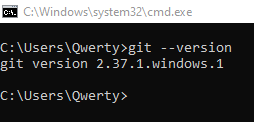
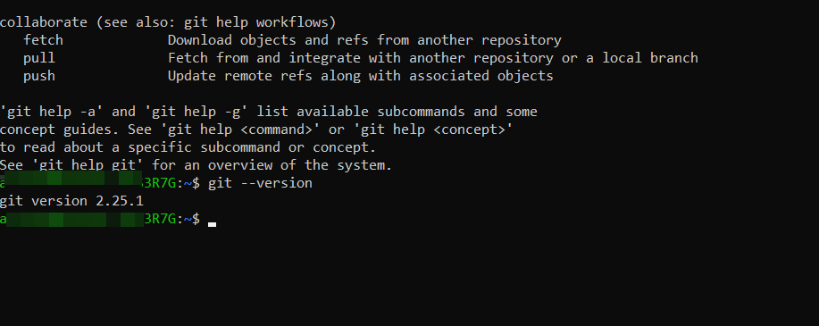

[< 1. Краткая история Git](./history1.md)

[> 3. Первоначальная настройка GIT](./setting3.md)

# **2. Установка GIT**

## **Установка GIT в Windows**
### **Проверка наличия _GIT_**

Для запуска командной строки нажмите клавиши Win +R и в появившемся окне введите *cmd* => нажмите “ОК”.

Введите:

> `$ git --version`

Если GIT уже был установлен, вам отобразится его версия:

Если _GIT_ не установлен, перейдите на [страницу](https://git-scm.com/download/win), скачайте подходящий дистрибутив и следуйте инструкциям.

-------------------------

## ***Установка _GIT_ в LInux Ubuntu (CLI apt)***

Проверка наличия _GIT_:
> `$ git --version`

Если вы хотите установить Git под Linux как бинарный пакет, это можно сделать, используя обычный менеджер пакетов вашего дистрибутива. Если у вас Fedora (или другой похожий дистрибутив, такой как RHEL или CentOS), можно воспользоваться dnf:

> `$ sudo dnf install git-all`

Если же у вас дистрибутив, основанный на Debian, например, Ubuntu, попробуйте apt:

> `$ sudo apt install git`

Чтобы воспользоваться дополнительными возможностями, посмотрите инструкцию по установке для нескольких различных разновидностей Unix на сайте _Git_ https://git-scm.com/download/linux.

-------------------------

## ***Установка _GIT_ в в MacOS***

Существует несколько способов установки _Git_ на Mac. Самый простой — установить _Xcode Command Line Tools_. В версии _Mavericks (10.9)_ и выше вы можете добиться этого просто первый раз выполнив 'git' в терминале.

> `$ git --version`

Если _Git_ не установлен, вам будет предложено его установить.

Если Вы хотите получить более актуальную версию, то можете воспользоваться бинарным установщиком. Установщик Git для OS X доступен для скачивания с сайта Git https://git-scm.com/download/mac.

-------------------------  

> Все доступные варианты установки вы можете посмотреть на официальном сайте _GIT_ в разделе [Downloads](https://git-scm.com/downloads).
